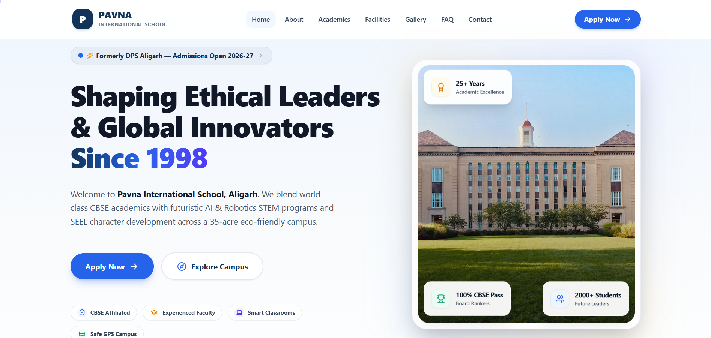
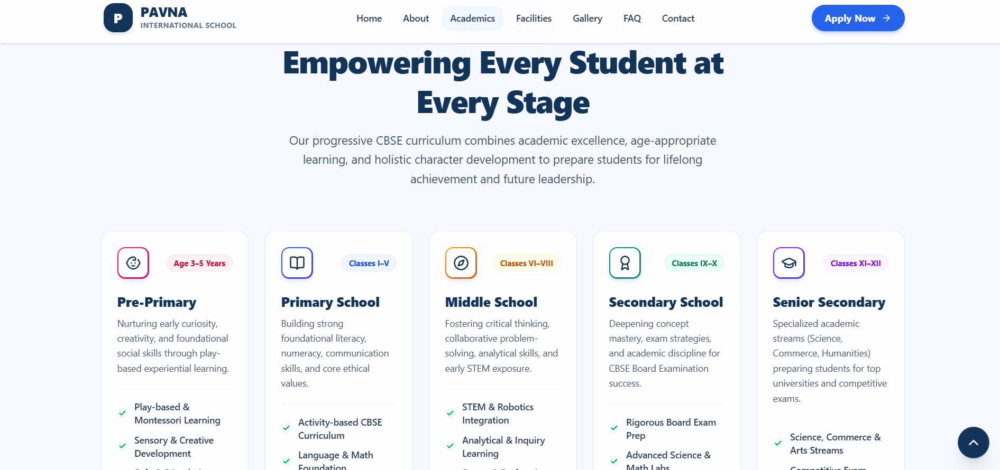
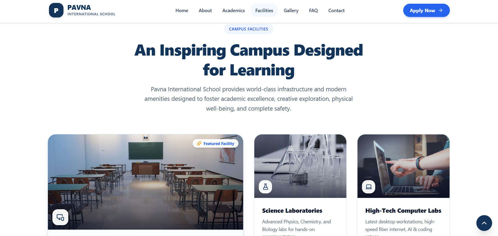
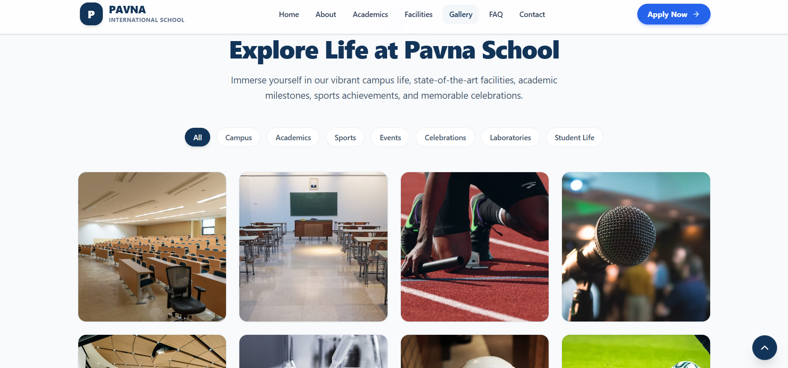

# 🎓 Pavna International School – Modern School Website Redesign

<p align="center">


</p>

<p align="center">
A modern, responsive, and accessible redesign of <strong>Pavna International School</strong> built with React, Vite, Tailwind CSS, and Framer Motion.
</p>

<p align="center">
Designed as a frontend development assignment with a strong focus on UI/UX, responsiveness, accessibility, smooth animations, and performance.
</p>

---

## 🌐 Live Demo

👉 **Website:**  
https://dettroin-int-shivam-verma-website-p.vercel.app/

---

# 📸 Project Preview

<table>
<tr>

<td width="50%">

### 🏠 Homepage



</td>

<td width="50%">

### 🎓 Academics



</td>

</tr>

<tr>

<td width="50%">

### 🏫 Campus Facilities



</td>

<td width="50%">

### 🖼️ Gallery



</td>

</tr>
</table>

---

# ✨ Features

- 🎨 Modern UI inspired by premium educational websites
- 📱 Fully responsive (Mobile • Tablet • Desktop)
- ⚡ Built using React + Vite
- 🎭 Smooth animations with Framer Motion
- 🎯 Interactive Hero section
- 📊 Animated statistics
- 🏫 Academic Programs
- 🧪 Campus Facilities
- 📸 Interactive Gallery
- 💬 Parent Testimonials
- ❓ Searchable FAQ
- 📩 Admission Call-to-Action
- ⬆️ Scroll-to-Top button
- ♿ Accessibility-focused components
- 🔍 SEO-friendly structure

---

# 🛠 Tech Stack

| Category | Technology |
|-----------|------------|
| Frontend | React 19 |
| Build Tool | Vite |
| Styling | Tailwind CSS v4 |
| Animations | Framer Motion |
| Routing | React Router |
| Icons | Lucide React |
| Carousel | Swiper.js |
| SEO | React Helmet Async |

---

# 📁 Project Structure

```text
src
│
├── assets
├── components
│   ├── hero
│   ├── about
│   ├── academics
│   ├── facilities
│   ├── gallery
│   ├── testimonials
│   ├── faq
│   ├── footer
│   └── ui
│
├── pages
├── router
├── utils
│
├── App.jsx
└── main.jsx

screenshots
├── homepage.png
├── academics.png
├── facilities.png
└── gallery.png
```

---

# 🚀 Getting Started

## Clone the Repository

```bash
git clone https://github.com/shivamvermajss/DETTROIN-INT-ShivamVerma-Website-Public.git
```

## Navigate to the Project

```bash
cd DETTROIN-INT-ShivamVerma-Website-Public
```

## Install Dependencies

```bash
npm install
```

## Start Development Server

```bash
npm run dev
```

Open

```
http://localhost:5173
```

---

# 📦 Production Build

Generate an optimized production build.

```bash
npm run build
```

Preview the production build locally.

```bash
npm run preview
```

---

# 🚀 Deployment

The project is deployed on **Vercel**.

```bash
npx vercel --prod
```

---

# 📱 Responsive Design

Optimized for:

- ✅ Mobile
- ✅ Tablet
- ✅ Laptop
- ✅ Desktop

---

# ⚡ Performance

The project emphasizes:

- Fast loading experience
- Responsive layouts
- Lazy-loaded assets
- Smooth animations
- SEO-friendly metadata
- Accessible UI components
- Clean component architecture

---

# ♿ Accessibility

- Semantic HTML
- Keyboard navigation
- ARIA attributes
- Focus management
- Accessible color contrast
- Responsive typography

---

# 🔮 Future Enhancements

- Student Login Portal
- Online Admission System
- CMS Integration
- Event Management
- School News & Announcements
- Dark Mode Support

---

# 👨‍💻 Author

### Shivam Verma

**Full Stack Developer (MERN)**

📧 GitHub  
https://github.com/shivamvermajss

💼 LinkedIn  
https://www.linkedin.com/in/shivam-verma-227b37384/

---

# 📄 License

This project is licensed under the **MIT License**.

---

## ⭐ If you found this project useful, consider giving it a Star on GitHub!
